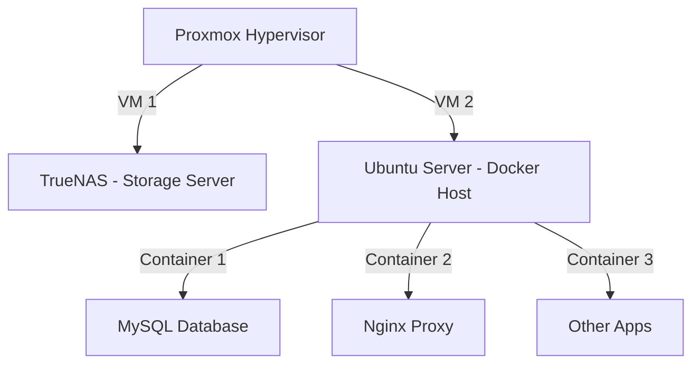

<h1 align="center">🚀 My Homelab Setup</h1>

  
  
  

## 🏠 Overview
This homelab is designed to explore **virtualization, storage solutions, and containerized applications**. The setup consists of:

- **Proxmox** as the hypervisor
- **Two Virtual Machines (VMs):**
  - **TrueNAS** for network-attached storage (NAS)
  - **Ubuntu Server** running Docker for hosting applications

---

## ⚙️ Homelab Architecture

---

## 📌 Virtual Machines

### 🗄️ TrueNAS (Storage)
- Handles file sharing across the network
- Uses **ZFS** for reliability & performance
- Provides **SMB & NFS** shares

### 🖥️ Ubuntu Server (Docker Host)
- Runs multiple Docker containers
- Hosts **MySQL, Nginx, and custom applications**
- Managed using **Portainer**

---

## 📦 Docker Containers
| Container  | Purpose |
|------------|---------|
| 🐳 **MySQL** | Database for apps |
| 🌍 **Nginx** | Reverse proxy for web services |
| 📂 **Portainer** | Web UI for managing Docker |
| 🛠️ **Custom Apps** | Various self-hosted tools |

---

## 🔗 Resources & Documentation
- **Proxmox Setup Guide:** [Official Docs](https://pve.proxmox.com/wiki/Main_Page)
- **TrueNAS Configuration:** [TrueNAS Docs](https://www.truenas.com/docs/)
- **Docker Best Practices:** [Docker Docs](https://docs.docker.com/)

---

- Add **Home Assistant** for smart home automation
- Implement **CI/CD pipelines** for self-hosted apps
- Integrate **monitoring tools** (Grafana + Prometheus)

💻 Built with ❤️ by <strong>Your Name</strong>

